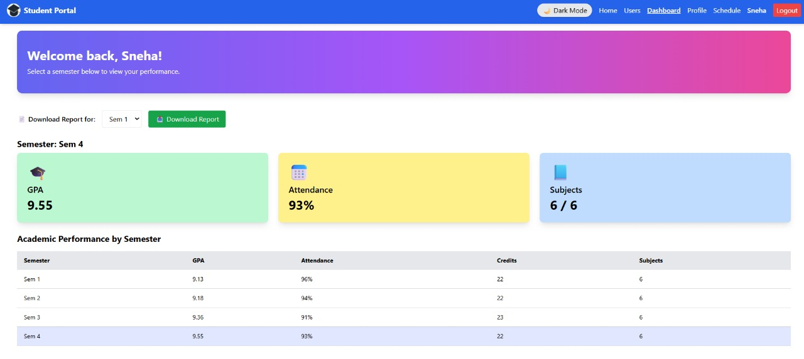
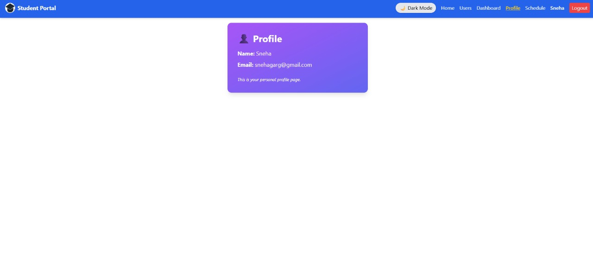
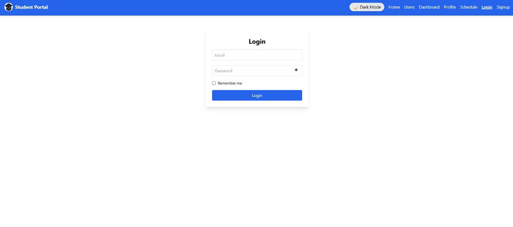
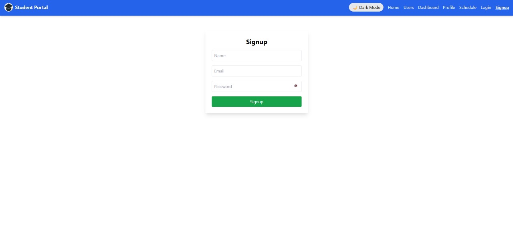
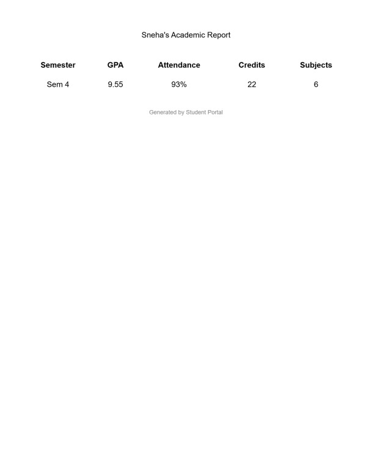

# 🎓 Student Portal

A responsive and feature-rich web app to manage academic information, view schedules, download reports, and more — built using React and Tailwind CSS.

---

## 🔗 Live Demo  
👉 [https://student-portal.netlify.app](https://student-portal.netlify.app)

---

## 🔧 Features Implemented

- 🔐 **Secure Login & Signup**
- 📋 **User Management** – Explore and manage student users with search/sort
- 📊 **Dashboard** – Interactive semester-wise statistics (GPA, Attendance, etc.)
- 📄 **PDF Report Download** – Download semester-wise academic performance
- 📅 **Timetable** – Organized day-wise schedule view
- 🌙 **Dark Mode Toggle**
- 💬 **Testimonial Section** – Hear from other students

---

## 📸 Screenshots

### 🏠 Home Page (Light Mode)


### 🌙 Home Page (Dark Mode)


### 📊 Dashboard (Light Mode)


### 📊 Dashboard (Dark Mode)


### 👤 Profile Page


### 👥 Users Page (Light Mode)


### 👥 Users Page (Dark Mode)


### 📅 Timetable (Light Mode)


### 📅 Timetable (Dark Mode)


### 🔐 Login


### 📝 Signup


### 📄 Semester-wise Downloaded Report


---

## 🧠 What I Learned

- Effective use of **React Context API** for authentication
- Building clean, modular UI using **Tailwind CSS**
- Generating downloadable PDFs with `html2pdf.js`
- Implementing **dark mode** and responsive layouts
- Managing and routing pages using **React Router**

---

## 🚀 Tech Stack

- ⚛️ React
- 🎨 Tailwind CSS
- 🔀 React Router
- 📄 HTML2PDF.js

---

## 📁 Getting Started

Clone the project and run locally:

```bash
git clone https://github.com/Snehagg88/student-portal.git
cd student-portal
npm install
npm start

---

## ▶️ Run the App
Runs the app in development mode.
Open http://localhost:3000 to view it in your browser.

The page will reload when you make changes.
You may also see any lint errors in the console.
