# 🎓 Student Portal

A responsive and feature-rich web app to manage academic information, view schedules, download reports, and more — built using **React** and **Tailwind CSS**.

---

## 🔗 Live Demo

View Live 👉 [https://student-portal-snehagg88.netlify.app](https://student-portal-snehagg88.netlify.app)

## 📂 GitHub Repo
GitHub 👉 [https://github.com/Snehagg88/student-portal](https://github.com/Snehagg88/student-portal)

---

## 🔧 Features Implemented

- 🔐 **Secure Login & Signup**
- 📋 **User Management** – Explore and manage student users with search/sort
- 📊 **Dashboard** – Interactive semester-wise statistics (GPA, Attendance, credits, etc.)
- 📄 **PDF Report Download** – Download semester-wise academic performance
- 📅 **Timetable** – Organized day-wise schedule view
- 🌙 **Light/Dark Mode Toggle**
- 💬 **Testimonial Section** – Hear from other students

---

## 📸 Screenshots

### 🏠 Home Page (Light Mode)
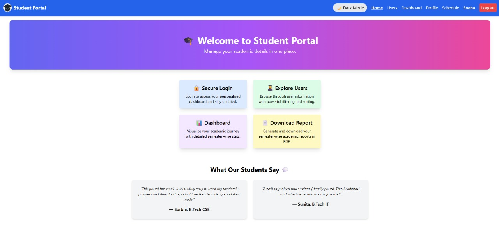

### 🌙 Home Page (Dark Mode)
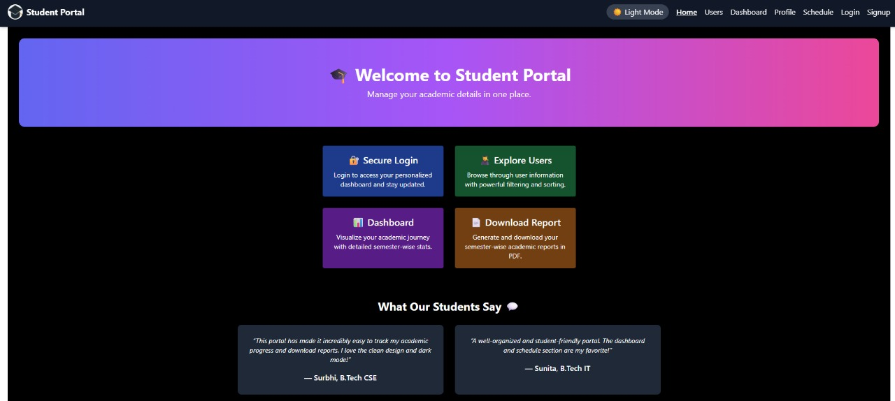

### 📊 Dashboard (Light Mode)
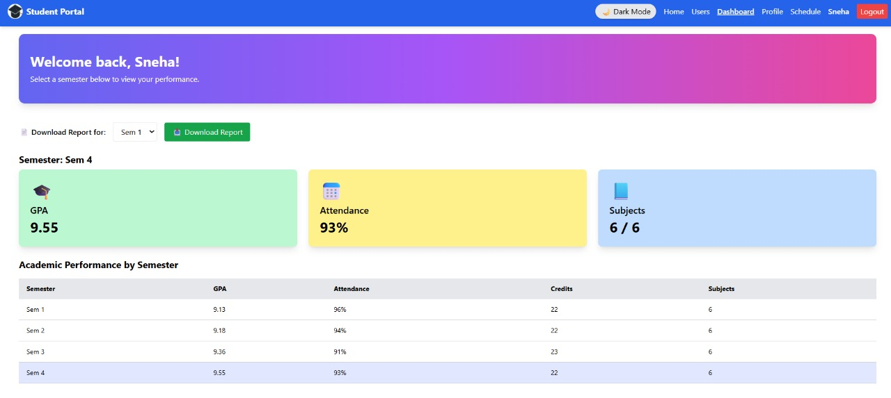

### 📊 Dashboard (Dark Mode)
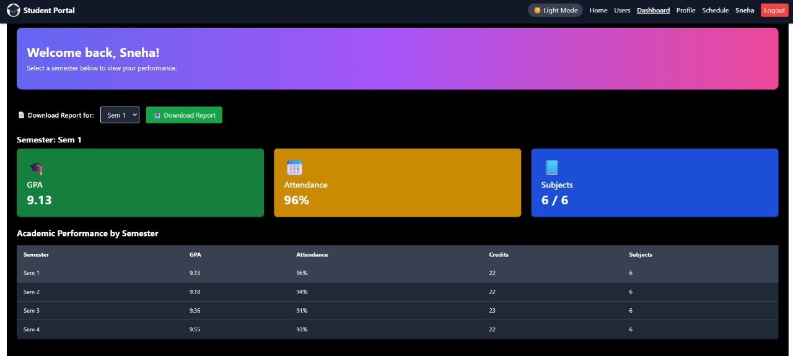

### 👤 Profile Page
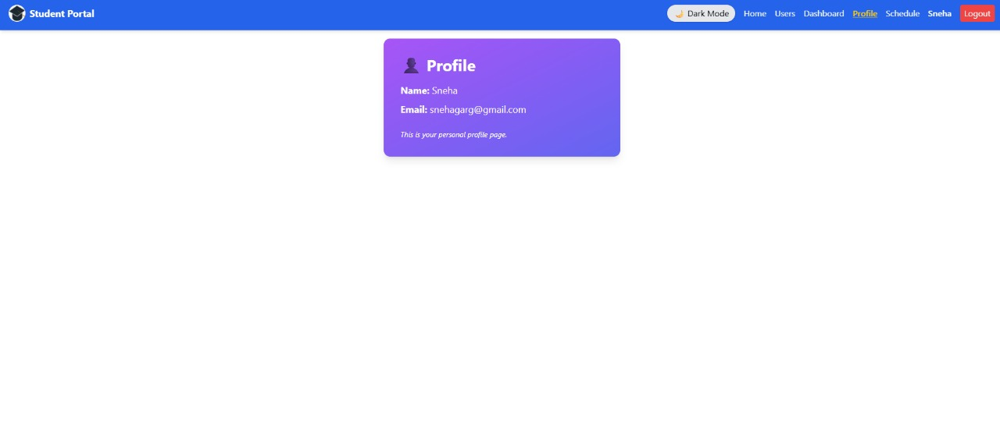

### 👥 Users Page (Light Mode)
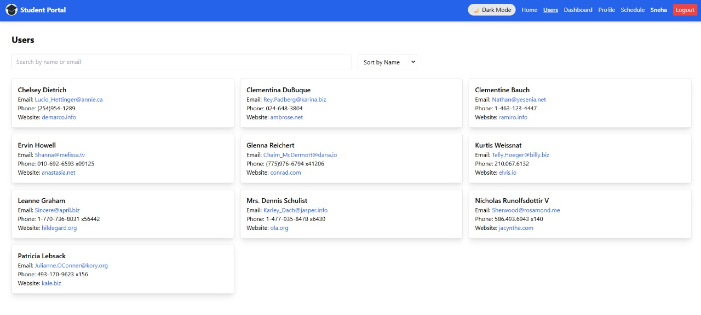

### 👥 Users Page (Dark Mode)


### 📅 Timetable (Light Mode)
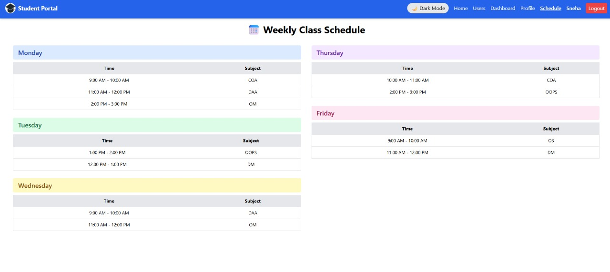

### 📅 Timetable (Dark Mode)
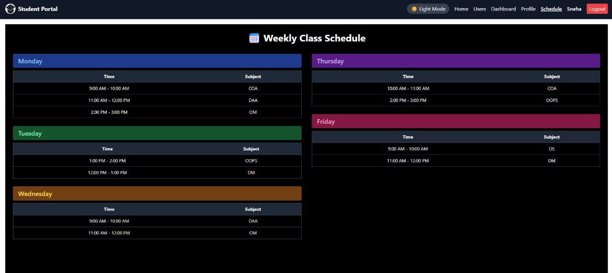

### 📄 Semester-wise Downloaded Report
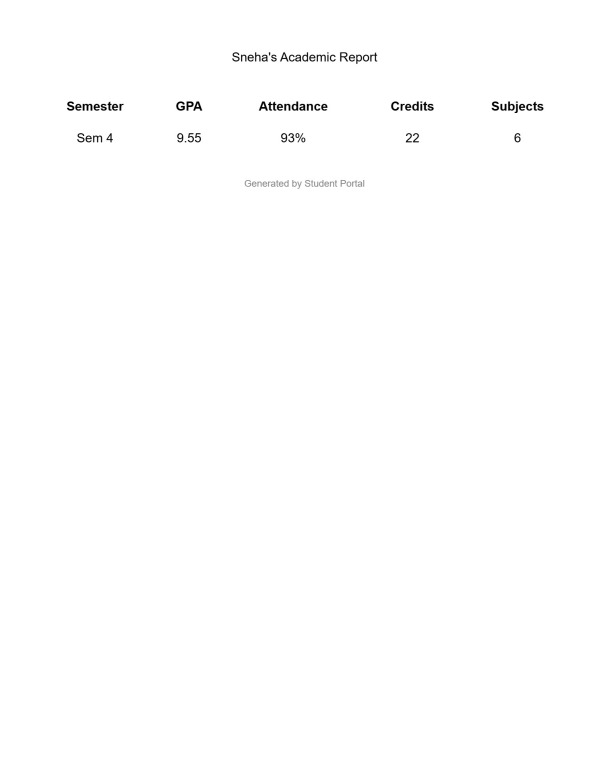

### 🔐 Login
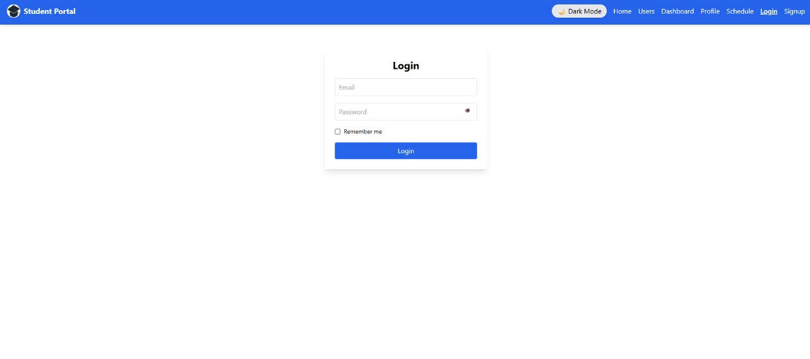

### 📝 Signup
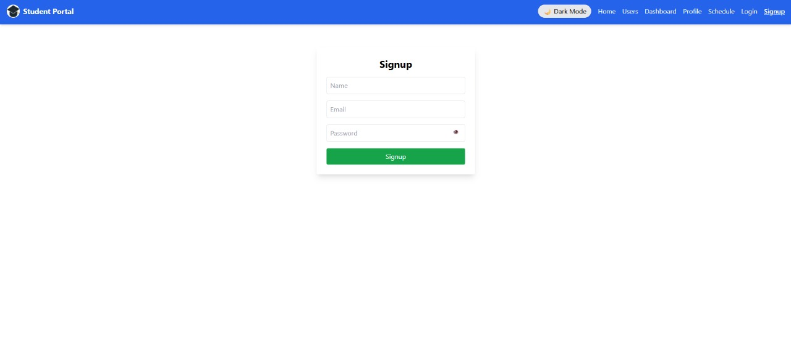

---

## 🧠 What I Learned & Challenges Faced

- Structured a scalable **multi-page React app** using React Router and Context API for global state management.
- Learned and applied **Tailwind CSS** for utility-first, responsive design — enabling clean layouts and dark mode support.
- Faced challenges aligning responsive **feature cards**, solved using Tailwind's `grid-cols` and `gap` utilities.
- Integrated **`html2pdf.js`** to generate downloadable, formatted PDF reports — overcame issues with rendering and export.
- Understood the importance of proper **routing fallback** using Netlify redirects for single-page applications.
- Gained hands-on experience with **Git**, GitHub version control, and **Netlify deployment pipelines**.

---

## 🚀 Tech Stack
- ⚛️ React
- 🎨 Tailwind CSS
- 🛠️ Create React App (CRA)
- 🌐 Netlify
- 📄 html2pdf.js
- 🧭 React Router
- 🧰 Git & GitHub
- 🧪 ESLint 
- ⚙️ Node.js & npm

---

## 📁 Getting Started

Clone the project and run locally:

```bash
git clone https://github.com/Snehagg88/student-portal.git
cd student-portal
npm install
npm start
``` <!-- ✅ Closing the code block here -->

---

## ▶️ Run the App

Runs the app in development mode.  
Open [http://localhost:3000](http://localhost:3000) to view it in your browser.  
The page will reload when you make changes.  
You may also see any lint errors in the console.

